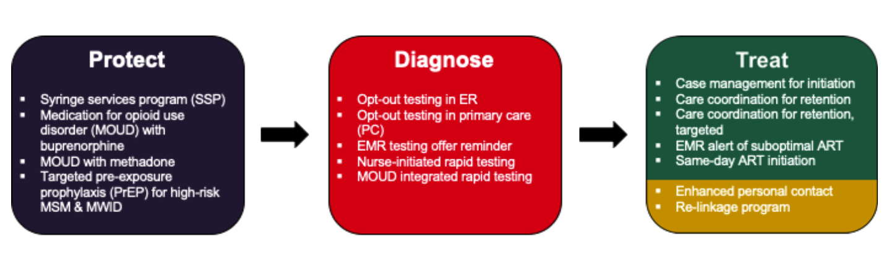

```{r, include = FALSE}
knitr::opts_chunk$set(
  collapse = TRUE,
  comment = "#>"
)
```

# 3.0 Generate possible intervention combinations {-}

In this component, we create all possible combinations of the 16 public health interventions selected from the the CDC’s Compendium of Evidence-Based Interventions and Best Practices for HIV Prevention [@EBIcompendium] using the R script *CascadeCEA-Interventions-0-Function-scale.interventions.combination.R*. See Figure 3 below for the list of interventions and their respective categories (*Protect, Diagnose, Treat*). This figure is also saved in the *figs* directory. Upon further assessment, we exclude combinations that would not be practically implemented jointly, termed “mutually exclusive combinations”. For example - two HIV testing interventions delivered in primary care. 

  

\vspace{12pt}

Next, we set intervention parameters using the *CascadeCEA-Interventions-0-Function-intervention.model.combination.R* script, and then use the *CascadeCEA-Interventions-0-Function-scale.interventions.combination.R* script to and calculate the scale of delivery inputs at each time step. Both are found in the *R* directory. Recall that scale refers to the proportion of a target population that is provided with an intervention. For HIV prevention programs, scale of delivery was the annual rate of expanded access, or additional scale-up, estimated using the best-available program-specific evidence. In contrast, for HIV testing and care interventions, scale of delivery was defined as the product of setting specific reach and adoption for each intervention *i*, target population *j* and healthcare setting *k*, where reach is defined as the participation rate in a given intervention, conditional on the probability an  individual will access services in setting *k* and the probability the individual will accept the intervention being delivered.

$$Scale_{i,j} = reach_{j,k} \times adoption_{i,k}$$

Lastly, to set indicators of modifying parameters in ODE model  we use the function in *CascadeCEA-Interventions-0-Function-true.false.interventions.combination.R*.

# 3.1 Derive intervention scale-up {-}

In this component we derive the scale of delivery (or scale-up) of interventions, implemented proportionally across groups, for each time step. Some parameters and interventions only had evidence and input data stratified by race and sex (ie. Opt-out testing in ER) while others were stratified by race, sex and risk group (ie.Same-day ART initiation). Table 3.0 specifies how interventions were stratified; note that how an intervention was stratified is a result of the dimensionality provided among best available evidence as detailed in our previous works [@evsynth]. Use *CascadeCEA-Interventions-0-Function-set.scale.race.gender.R* and *CascadeCEA-Interventions-0-Function-set.scale.risk.race.gender.R* to derive scale-up for interventions. In these scripts, matrices for scale estimates (with upper and lower bounds) are created; they each have 19 rows (one for each model compartment/state) and 42 columns (one for each population strata).

Table 3.0: (\tab:int-strat) Stratification of interventions input data

| **Stratified by**     | **Interventions**                             
|:----------------------|:---------------------------------------------:|
| Race, Sex             | ####Diagnose             
|                       |   * Opt-out testing in ER               
|                       |   * Opt-out testing in primary care          
|                       |   * Nurse initiated rapid testing            
|                       |   * Emr testing offer reminder              
| Race, Sex, Risk Group | ####Protect                          
|                       |   * Syringe Service Program (SSP)             
|                       |   * Medication for opioid use disorder (MOUD) with buprenorphine     
|                       |   * Medication for opioid use disorder (MOUD) with methadone           
|                       |   * Targeted PrEP for high-risk MSM and MWID   
|                       |                                             
|                       | ####Diagnose                    
|                       |   * MOUD integrated rapid testing            
|                       |                                               
|                       | ####Treat            
|                       |   * Individual case management for ART initiation initiation                               
|                       |   * Individual care coordination for ART retention   
|                       |   * Individual care coordination for ART retention, targeted                       
|                       |   * EMR alert for suboptimal ART engagement  
|                       |   * Rapid/Same-day ART initiation             
|                       |   * ART Re-engagement - Enhanced personal contact
|                       |   * ART Re-linkage program                    


# 3.2 Model outcomes

In this component we run several R scripts that set up the production of model outcomes for output to excel. Model projected outcomes such as incremental and total costs (2018 USD) and QALYs gained are produced for each city, for the combinations of interventions, considering implementation and sustainment periods determined in Section 3.1.

Point estimates, and upper and lower bounds for estimates are first organized in arrays (using *CascadeCEA-Interventions-0-Function-accumulate.outcomes.combination.R* script). [Add in further details about `psi.matrix.temp`,`art.init.matrix` for example "`psi.matrix.temp` function does X"]. The number of infections for a given year (annual incidence rate) and cumulatively over several time horizons (5, 10, 20 years) are calculated for each city using *CascadeCEA-Interventions-0-Function-time.period.infections.R*. Both sets of output results (costs and QALYs, and number of infections) can then be exported to excel using the `write.excel` function as seen in *CascadeCEA-Interventions-0-Output-write.excel.R* script. [consider adding in a screenshot of what the output results in Excel so users know what to expect?] Lastly, population lists and number of infections for each time step, cost-effectiveness analyses results etc. are calculated and aggregated using the *CascadeCEA-Interventions-0-Function-comb.eva.func.R* script. 

# References {-}
